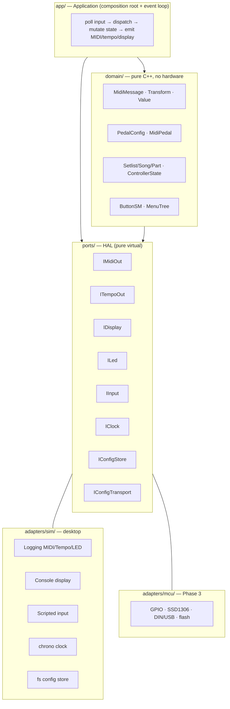
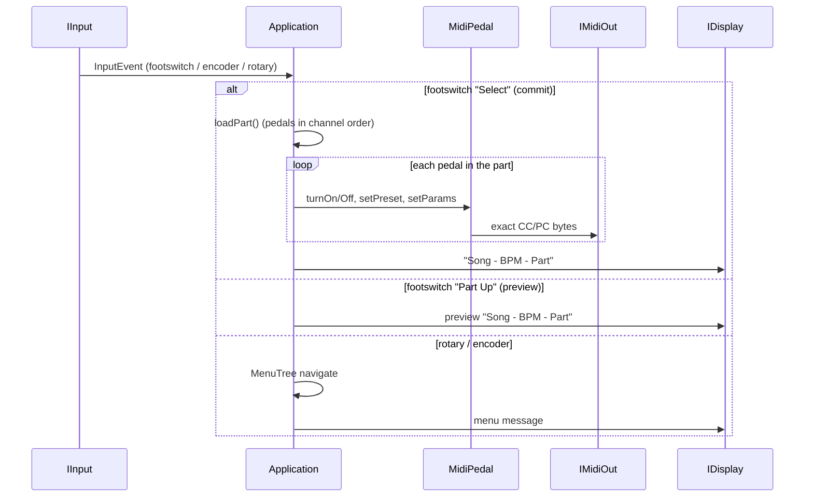

# MidiController (C++)

A clean, portable C++ rewrite of the **brain** of a guitar-pedal MIDI
controller — originally Python on a Raspberry Pi 4 (6 footswitches, an OLED, an
RGB rotary knob, 2 MIDI outs, 4 tempo jacks). The Pi built MIDI messages and
song/preset state; an Arduino emitted the bytes; a Java HTTP bridge + web app
edited config over WiFi.

This port moves that brain into hardware-free C++ so it can later drop onto a
microcontroller (WiFi → USB) unchanged. The design is **ports & adapters
(hexagonal)**: a pure domain core, all hardware behind interfaces, the same core
running on the desktop sim today and an MCU later.

> Status: **Phase 1 (domain + config) and Phase 2 (sim, event loop, e2e, docs)
> are complete and fully tested.** Phase 3 (microcontroller adapters) and Phase 4
> (controller app) are future work. The living roadmap is [`docs/plan.md`](docs/plan.md).

## Build & test (WSL)

Everything builds with `g++` (C++17) and `make` — no apt packages: GoogleTest,
GoogleMock and nlohmann/json are vendored under `third_party/`.

```sh
make build   # compile the sim         -> build/midicontroller
make test    # build & run all suites  (unit + mock + e2e)
make run     # launch the simulator (reads data/, runs a scripted demo)
make clean   # remove build artifacts
```

The data under `data/*.json` is produced once from the original Python YAML by
`tools/yaml2json.py` (already run and committed).

## Architecture



The domain core never includes a hardware header or even the JSON library — only
`config/ConfigLoader` touches nlohmann/json, so the Phase-3 swap to an
MCU-friendly parser is one local edit.

## Event loop



## Layout

```
include/mc/        public headers (domain · ports · config · adapters · app)
src/               implementations + main.cpp
data/              converted JSON: midi_controller.json, pedals/, songs/, sets/
tests/             unit/ · mock/ · e2e/ · support/
tools/yaml2json.py one-shot YAML→JSON converter
third_party/       vendored googletest + nlohmann/json
docs/              plan.md · domain.md · midi-protocol.md · config-format.md · architecture.md
Makefile
```

## Tests

`make test` runs three tiers (see [`docs/plan.md`](docs/plan.md) §Tests):

- **unit** — `Transform` parse/eval, `MidiMessage` byte exactness, `ButtonSM`
  timing (fake clock), `MenuTree` navigation, and the JSON loaders against the
  real fixtures.
- **mock** — `MidiPedal` against a recording / GoogleMock `IMidiOut`, asserting
  the **exact** CC/PC byte sequence for every real pedal config (engage, bypass,
  preset, multi bank/preset, params, tempo).
- **e2e** — drives the whole `Application` with scripted input + a fake clock +
  the converted real fixtures, asserting the MIDI/tempo/display sequence across
  load → preview/commit → next song → rotary menu edit.

## Faithful-port note

The port reproduces the Python brain's observable MIDI **byte-for-byte**,
including a couple of load-bearing quirks (most notably: the `bank` sub-action of
"Set Preset" uses `cc: 0`, which Python treats as falsy, so the bank select is
never sent — only the preset Program Change goes out). These are documented in
[`docs/midi-protocol.md`](docs/midi-protocol.md); the tests lock them so the rig
behaves identically.
