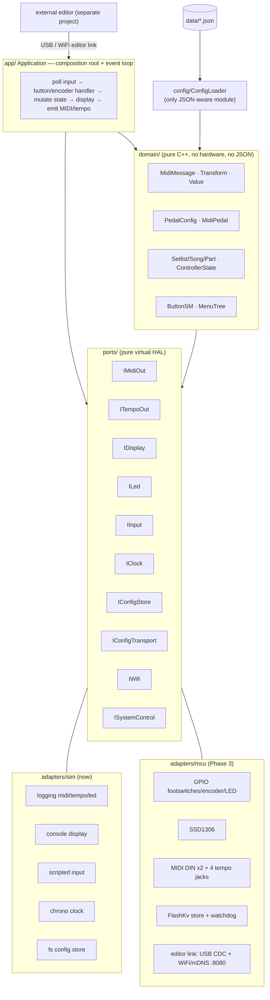
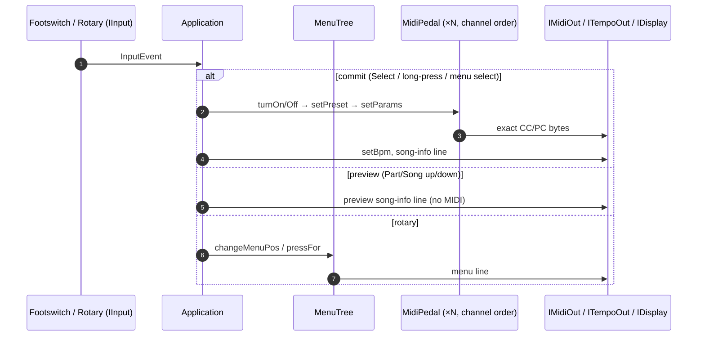

# Architecture

Ports & adapters (hexagonal). The domain core is pure C++ and depends only on
the **ports** (interfaces). Adapters implement the ports for a target; the
`Application` wires a concrete set of adapters to the core and runs the loop.

Data flow on a "load part":

> An `architecture.excalidraw` can be exported from the Mermaid above if a
> hand-editable canvas is wanted; the Mermaid here is the canonical source.
